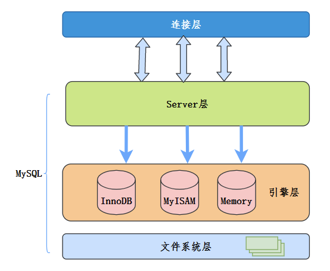

# MySQL


[TOC]

### 连接

- **内连接**（Inner Join）仅返回两个表中都有匹配的行。
- **左外连接**（Left Join）返回左表的所有行，以及右表中匹配的行；如果右表没有匹配，则显示空值。
- **右外连接**（Right Join）返回右表的所有行，以及左表中匹配的行；如果左表没有匹配，则显示空值

## 索引

索引是帮助MySQL高效获取数据的排好序的数据结构，它提前按照一定的规则进行排序和组织，能够帮助快速定位记录。

### 索引数据结构

#### B+树：

B+树是B树的变种。在B+树中，所有的数据都存储在叶子节点中，并且叶子节点之间是相互链接的。（内部节点只存储键值，而不包含实际数据。）

**与B树的对比：**

- **数据存储**：B树的数据存储在整个树中，而B+树的数据只存储在叶子节点。
- **树高**：B+树的树高通常低于B树，因为内部节点不存储数据。
- **范围查询**：B+树由于其叶子节点的链表结构，更适合于范围查询。
- **磁盘读写**：B+树由于更低的树高和有序的叶子节点，更适合于磁盘读写操作。


Mysql**索引使用不使用二叉树而使用B+树的原因**

在处理自增数据时，存放在二叉树中对索引效率提升没有帮助

- **磁盘 I/O 最小化**：
  - B+树是一种多路平衡搜索树，相比于二叉树，它有更低的树高，可以减少磁盘读写次数。在数据库操作中，磁盘 I/O 通常是性能瓶颈，因此减少读取次数对于提高查询效率至关重要。
- **更好的数据局部性**：
  - B+树的节点存储多个键值，这意味着它们可以利用磁盘块的空间，提高数据的局部性。数据局部性的提高可以减少磁盘寻道时间和读取时间。
- **高效的范围查询**：
  - B+树的所有数据指针都存在叶子节点，并且叶子节点之间是相互链接的。这使得对于范围查询，B+树比二叉树更高效，因为它可以通过遍历叶子节点的链表来顺序访问所有在范围内的数据。
- **插入和删除操作的优化**：
  - 在 B+树中，插入和删除操作通常更加高效，因为它们只需要对树进行局部调整。与之相比，二叉搜索树可能需要更频繁的平衡操作（例如，在 AVL 树或红黑树中）。
- **节省空间**：
  - 由于 B+树的分支节点不存储数据，只存储键和子节点的指针，因此可以有更多的分支，从而使树的高度更低。这在存储大量数据时节省了空间。


#### MyISAM存储引擎

- 早期的默认存储引擎，适用于 MySQL 5.5.5 之前的版本。
- **不支持事务和行级锁定**，但提供全文搜索功能。
- 适合于读密集型的应用，如博客、CMS 系统等。

##### **MyISAM**索引实现（非聚集索引）

索引文件和数据文件分离（非聚集索引）


#### InnoDB存储引擎

- 是 MySQL 的默认存储引擎（自 MySQL 5.5.5 版本开始）。
- 支持事务处理，具备 ACID（原子性、一致性、隔离性、持久性）属性。
- 提供行级锁定和外键约束支持。
- 适合处理大量数据的情况，优秀的崩溃恢复能力。

##### InnoDB索引实现（默认为主键创建聚集索引）

+ 表数据按照B+Tree组织一个索引结构文件
+ 聚集索引-叶子结点包含完整记录
+ InnoDB建议必须建立主键，推荐使用**整形自增**主键：整形方便比较，自增因为要求有顺序每个节点有存储上限，自增的索引可以减少平衡次数
+ InnoDB二级索引，所谓非主键索引都可以称为二级索引，**二级索引是非聚集索引**，需要回表


#### 哈希索引（不常用因为无法范围查找）

Memory引擎支持

1. ##### **快速查找**：

   - 哈希索引可以提供非常快的数据访问速度，尤其是对于等值查询（如 `WHERE key = value`）。

2. **不适合范围查询**：

   - 哈希索引不适用于范围查询（如 `WHERE key > value`）。这是因为哈希函数的输出不保留键的顺序。

3. **处理哈希冲突**：

   - 如果两个不同的键产生相同的哈希值（即哈希冲突），则需要有机制来处理这种情况，通常是通过链表或开放寻址。

4. **内存使用**：

   - 哈希索引通常存储在内存中，这意味着它们可以提供快速的访问速度。但这也意味着它们可能受限于内存大小。

##### 使用场景

- **适合场景**：

  - 适合于高速查找和频繁更新的场景。
  - 适用于需要快速查找特定键值的应用，如缓存系统。

- **不适合场景**：

  - 不适合于需要进行范围查询的场景。
  - 对于具有大量重复键值的数据不太有效。

  

#### Full-text索引

全文索引（Full-text Index）是数据库中用于提升全文搜索效率的一种特殊类型的索引。它主要用于搜索文本中的关键词，而不是比较文本整体的相等性。这种索引适用于寻找包含某些词（单词或短语）的文档或记录，特别适用于大量文本数据的搜索，如文章、邮件内容、产品描述等。


### 复合（联合）索引的结构

假设有一个复合索引包含三个列：`(A, B, C)`。这个索引可以被视为按照列 A、列 B 和列 C 排序的数据列表。

##### 最左前缀原则的含义

1. **索引的使用**：
   - 如果查询条件包含了索引的最左边的列（即列 A），则优化器可以利用该索引。
   - 如果查询条件不包括最左边的列（只包括 B 或 C），则无法充分利用这个索引。
2. **部分使用索引**：
   - 如果查询条件包括列 A 和列 B，索引将非常有效。
   - 如果查询条件只包括列 A，索引仍然有用，但不如同时包含 A 和 B 那么有效。
3. **顺序重要**：
   - 查询条件中涉及的列的顺序应该与索引中列的顺序一致。例如，针对 `(A, B, C)` 的索引，条件应该是基于 A 或 A 和 B，或 A、B 和 C 的顺序。

##### 例子

假设有一个表 `users`，其上有一个复合索引 `(first_name, last_name, age)`。以下是一些查询例子，说明最左前缀原则的应用：

- `SELECT * FROM users WHERE first_name = 'John'`：
  - 这个查询可以充分利用索引。
- `SELECT * FROM users WHERE first_name = 'John' AND last_name = 'Doe'`：
  - 这个查询可以更有效地利用索引，因为它使用了索引的前两列。
- `SELECT * FROM users WHERE last_name = 'Doe'`：
  - 这个查询无法利用索引，因为它没有使用索引的最左列。
- `SELECT * FROM users WHERE first_name = 'John' AND age = 30`：
  - 这个查询只能部分利用索引（仅针对 `first_name`），因为 `age` 不是紧随 `first_name` 的列。


### 索引覆盖

需要查询的字段都在索引列当中，不需要回表等，就是覆盖查询

**覆盖索引**是指一个索引包含（或“覆盖”）了查询所需的所有数据。换句话说，如果一个查询能够仅通过访问索引就获取其需要的所有信息，而不需要回表查询原始数据行，那么这个索引就被称为覆盖索引。

当执行一个查询时，如果数据库可以仅通过访问索引来获取所需的所有数据列，它就不需要再去访问数据表中的实际数据行。这减少了数据访问的数量，因此可以显著提高查询速度。


### 索引的使用和优缺点

优点：

+ 提高检索效率
+ 降低排序成本，索引对应字段有自动排序的功能

缺点：

+ 创建和维护索引耗费时间，数据越多耗费的时间越多
+ 索引占用的物理空间随着数据量增大而增大
+ 降低表的增删改效率，需要动态维护


### 索引失效

order by 或者 范围查找失效，查询优化器认为回表代价太大，不如直接全表扫描

1. **使用非索引列作为查询条件**: 当查询条件不涉及索引列时，索引无法被使用。
2. **在索引列上使用函数或表达式**: 如`SELECT * FROM table WHERE YEAR(date_column) = 2021;`。这里，即使`date_column`上有索引，使用`YEAR()`函数也会导致索引失效。
3. **隐式类型转换**: 当查询条件中的数据类型与索引列的类型不一致时，可能会导致索引失效。例如，如果索引列是字符串类型，但查询条件使用数字进行比较，索引可能不会被使用。**因为索引使用字符串构建的，需要转换索引到字符串才能进行查找代价太大**
4. **使用`LIKE`操作符以通配符开头**: 如`SELECT * FROM table WHERE column LIKE '%value%';`。如果模式以通配符开头，索引将不会被使用。
5. **使用`OR`条件连接不同列**: 如果使用`OR`连接不同的列，且这些列分别有不同的索引，那么索引可能不会被有效使用。
6. **索引列参与计算或运算**: 如果在索引列上进行计算或运算，如`SELECT * FROM table WHERE column + 1 = value;`，这通常会导致索引失效。
7. **范围查询之后的列**: 在复合索引的情况下，如果对第一个索引列进行范围查询（如`>`、`<`、`BETWEEN`、`LIKE`等），那么该列之后的索引列将不被利用。
8. **返回大量数据的查询**: 如果查询**返回表中大部分的行，查询优化器可能决定全表扫描比使用索引更有效**。
9. **不匹配的字符集和校对规则**: 如果查询的字符集或校对规则与索引列的不一致，可能导致索引失效。
10. **NULL值的处理**: 在某些情况下，包含NULL值的列可能不会有效地使用索引。


### 索引下推

索引下推（INDEX CONDITION PUSHDOWN，简称 ICP）是在 MySQL 5.6 针对**扫描二级索引**的一项优化改进。总的来说是通过把索引过滤条件下推到**存储引擎**，来减少 MySQL 存储引擎访问基表的次数以及 MySQL 服务层访问存储引擎的次数。ICP 适用于 MYISAM 和 INNODB。（减少回表次数）



```sql
Explain SELECT * FROM user1 WHERE name LIKE 'A%' and age = 40;
```


## 事务

### ACID

**数据库事务是一系列操作，这些操作要么全部成功执行，要么全部不执行**。事务是数据库管理系统中的一个关键概念，用于确保数据的完整性和一致性。事务具有以下四个主要特性，通常被称为ACID特性：

1. **原子性（Atomicity）**：事务中的所有操作要么全部完成，要么全部不完成。如果事务中的某个操作失败，整个事务将回滚到事务开始前的状态。**原子性由undo log保证**
2. **一致性（Consistency）**：事务必须保证数据库从一个一致的状态转移到另一个一致的状态。这意味着事务的执行结果必须符合所有数据库规则，包括数据完整性约束。**由其他三个性质保证**和业务逻辑保证
3. **隔离性（Isolation）**：事务的执行不应该被其他事务干扰。多个并发事务之间的操作应该是相互隔离的，以防止数据不一致。**由MVCC保证**
4. **持久性（Durability）**：一旦事务完成（提交），它对数据库的更改是永久性的，即使系统发生故障也不会丢失。**持久性由redo log保证**可以从redo log恢复，redo log刷盘在空闲时进行


##### Undo Log

- **Undo log** 用于记录事务执行前的数据状态。这使得数据库可以在事务失败或需要回滚时恢复旧数据。
- 它通常存储在硬盘上，以确保即使在数据库崩溃的情况下也能够执行事务回滚。

##### Redo Log

- **Redo log** 记录了事务所做的修改，以便在数据库崩溃后重新应用这些修改，确保事务的持久性。
- 这些日志同样存储在硬盘上，因为它们必须在系统恢复后仍然可用。

### 事务隔离级别

MySQL支持以下四种事务隔离级别，每个级别在提供数据一致性和并发性能之间做出不同的平衡。隔离级别从低到高排列如下：

1. **读未提交（Read Uncommitted）**:
   - 这是最低的隔离级别。
   - 在此级别，事务可以读取尚未提交的其他事务所做的更改。
   - 这可能导致“脏读”，即一个事务可能读取到另一个事务未提交的数据，如果那个事务失败并回滚，读取的数据就是无效的。
2. **读已提交（Read Committed）**:
   - 在此级别，事务只能读取已经提交的更改。
   - 这避免了脏读，但仍然可能出现“**不可重复读**”，即在同一事务中，两次读取同一数据可能得到不同的结果，因为在两次读取之间，另一个事务可能修改了数据并提交。
3. **可重复读（Repeatable Read）**:
   - 这是MySQL的默认隔离级别。**MVCC，通过undo log实现，绑定第一次查询的数据**
   - 在此级别，事务保证在整个事务期间可以多次读取同一数据并获得相同的结果，即使其他事务在此期间提交了更改。
   - 这避免了不可重复读，但可能导致“**幻读**”，即当一个事务在读取某个范围的记录时，另一个事务插入了新记录，当再次读取时就会看到新的“幻影”记录。
4. **串行化（Serializable）**:
   - 这是最高的隔离级别。
   - 它完全串行化处理事务，以确保事务之间不会相互影响。
   - 这避免了幻读，但可能会导致大量的锁和降低数据库的并发性能。

即使是最低级别的隔离（如读未提交，Read Uncommitted）也通常会阻止脏写


### MVCC

**MVCC 读的是历史数据，写的是现实数据**

多版本并发控制（Multi-Version Concurrency Control, MVCC）是 MySQL 的 InnoDB 存储引擎实现隔离级别的一种具体方式，用于实现**提交读**和**可重复读**这两种隔离级别。其他两个和MVCC不兼容。未提交读隔离级别总是读取最新的数据行，要求很低，无需使用 MVCC。可串行化隔离级别需要对所有读取的行都加锁，单纯使用 MVCC 无法实现。

#### 基本思想

在封锁一节中提到，加锁能解决多个事务同时执行时出现的并发一致性问题。在实际场景中读操作往往多于写操作，因此又引入了读写锁来避免不必要的加锁操作，例如读和读没有互斥关系。读写锁中读和写操作仍然是互斥的，而 MVCC 利用了多版本的思想，写操作更新最新的版本快照，而读操作去读旧版本快照，没有互斥关系，这一点和 CopyOnWrite 类似。

**在 MVCC 中事务的修改操作（DELETE、INSERT、UPDATE）会为数据行新增一个版本快照。**

脏读和不可重复读最根本的原因是事务读取到其它事务未提交的修改。在事务进行读取操作时，为了解决脏读和不可重复读问题，MVCC 规定只能读取已经提交的快照。当然一个事务可以读取自身未提交的快照，这不算是脏读。

#### MVCC的工作原理

1. **数据版本化**:
   - 在MVCC中，每次数据被修改时，系统不会直接覆盖旧数据，而是创建数据的新版本。这意味着同一数据可以存在多个版本。
2. **事务快照**:
   - 当一个事务开始时，它会获得一个数据库的快照。这个快照基于数据的版本生成，反映了事务开始时数据库的状态。
3. **非阻塞读取**:
   - 事务可以读取快照中的数据而不会被其他事务的写操作阻塞，因为写操作会生成数据的新版本，而不是直接修改当前版本。
4. **版本控制**:
   - 系统会维护每个数据版本的有效时间或事务ID范围。事务只能看到在其快照时间范围内有效的数据版本。

#### MVCC的优点

1. **提高并发性能**:
   - MVCC允许读取操作和写入操作在不同版本的数据上同时进行，从而减少了锁的需要，提高了并发性能。
2. **减少锁争用**:
   - 因为读取操作通常不需要锁定资源，所以减少了锁争用的可能性。
3. **防止幻读**:
   - 在某些隔离级别下，MVCC可以防止幻读，因为事务只能看到其快照中的数据。
4. **支持乐观并发控制**:
   - MVCC是实现乐观并发控制的基础，它假设多个事务通常不会冲突，只在提交时检测数据冲突。

#### 版本号

- 系统版本号 SYS_ID：是一个递增的数字，每开始一个新的事务，系统版本号就会自动递增。
- 事务版本号 TRX_ID ：事务开始时的系统版本号。

#### Undo 日志

MVCC 的多版本指的是多个版本的快照，快照存储在 Undo 日志中，该日志通过回滚指针 ROLL_PTR 把一个数据行的所有快照连接起来。


### 锁

#### MySQL中的锁分类

- 按粒度分**表锁**、**行锁**和**页锁**三种，

- 按类型分**读锁和写锁(都属于悲观锁)**两种。

- 按性能分**乐观锁**、**悲观锁和意向锁**。

##### 表锁，行错，页锁

+ 表锁： **开销小，加锁快；不会出现死锁；**锁定粒度大，发生锁冲突的概率最高，并发度最低；一般用在整表数据迁移的场景。
+ 行锁：**开销大，加锁慢；会出现死锁；**锁定粒度最小，发生锁冲突的概率最低，并发度最高。在 MySQL 中，**行锁是基于索引加载的**，即行锁是要加在索引响应的行上。**索引失效时会升级为表锁。**
+ 页锁：只有BDB存储引擎支持页锁，页锁就是在页的粒度上进行锁定，锁定的数据资源比行锁要多，因为一个页中可以有多个行记录。

##### 读锁、写锁、意向锁

读锁（共享锁，S锁（shared））：

多个读操作对同一个资源共享同一个锁，多个读操作可以同时进行而不会互相影响。因为读操作并不会改变数据内容，所以多个事务可以共享同一个锁，并行地读取同一个资源，这样可以提高并发效率。

写锁（排它锁，X锁（exclude））：

当两个事务同时对表中某行数据进行更新操作时，若一个事务先到达并给该行加上排它锁，那么另一个事务就不能在该行加任意类型的锁，直到第一个事务释放了该行的锁。因此，排它锁可以确保在同一时间只有一个事务可以对被加锁的资源进行修改操作，从而避免出现数据竞争和不一致问题。

意向锁（I锁（Intent Lock））：

数据库中的一种表级锁，在行级锁的基础上引入的一种概念。意向锁是用于解决多粒度锁定而设计的，可以避免行级锁和表级锁之间的冲突。
意向锁分为两种类型：**意向共享锁（Intention Shared Lock, IS）和意向排他锁（Intention Exclusive Lock, IX）**。

- **意向共享锁（IS）**：在一个事务需要对表中某些行加共享锁（S锁）时，事务首先需要获得表的意向共享锁（IS锁）

- **意向排他锁（IX）**：指的是在一个事务需要对表中某些行加排它锁（X锁）时，事务首先需要获得表的意向排它锁（IX锁）。

**意向锁简单来说就是添加行锁时，给表添加一个标识表明该表已经存在共享锁或者是排它锁，其他事务需要加锁直接读取该标识判断是否已经存在锁。**


##### 悲观锁

总是假设最坏的情况，每次去拿数据的时候都认为别人会修改，所以每次在拿数据的时候都会上锁，这样别人想拿这个数据就会阻塞直到它拿到锁（**共享资源每次只给一个线程使用，其它线程阻塞，用完后再把资源转让给其它线程**）。传统的关系型数据库里边就用到了很多这种锁机制，比如行锁，表锁等，读锁，写锁等，都是在做操作之前先上锁。Java中`synchronized`和`ReentrantLock`等独占锁就是悲观锁思想的实现。


##### **乐观锁**

总是假设最好的情况，每次去拿数据的时候都认为别人不会修改，所以不会上锁，但是在更新的时候会判断一下在此期间别人有没有去更新这个数据，可以使用版本号机制和CAS算法实现。**乐观锁适用于多读的应用类型，这样可以提高吞吐量**，像数据库提供的类似于**write_condition机制**，其实都是提供的乐观锁。在Java中`java.util.concurrent.atomic`包下面的原子变量类就是使用了乐观锁的一种实现方式**CAS**实现的。


MVCC 的 SELECT 操作是快照中的数据，不需要进行加锁操作。但可以强制指定进行加锁操作。

MVCC 其它会对数据库进行修改的操作（INSERT、UPDATE、DELETE）需要进行加锁操作，从而读取最新的数据。可以看到 MVCC 并不是完全不用加锁，而只是避免了 SELECT 的加锁操作。


### 提交

#### 自动提交模式

- MySQL默认启用自动提交模式。在这种模式下，每个**单独的SQL语句都被视为一个事务**，并在执行后立即提交。
- 可以通过设置`autocommit`变量来控制这一行为。例如，`SET autocommit=0;`将关闭自动提交。

##### 手动管理事务

- 在手动提交模式下，可以用`START TRANSACTION`或`BEGIN`命令开始一个新事务。
- 在事务中执行的更改操作（如`INSERT`、`UPDATE`、`DELETE`）将等待直到执行`COMMIT`命令后才被永久保存。
- 如果需要撤销事务中的操作，可以使用`ROLLBACK`命令。

##### 使用场景

- 在需要确保多个更改作为一个整体一起成功或失败时，应使用显式事务。这对于维护数据完整性和一致性非常重要。
- 例如，在转账操作中，从一个账户扣款并向另一个账户存款应该作为一个事务来处理。


## 优化

#### 慢SQL你是怎么优化的

针对SQL慢查询，可以考虑以下一些优化措施：

1. **优化查询语句结构：**检查是否存在冗余的操作、重复的子查询、不必要的排序、大量的JOIN操作等。优化查询语句的结构和逻辑，减少不必要的数据读取和计算。
2. **添加合适的索引：**确保查询中涉及的列都有适当的索引，并且查询条件能够充分利用索引。通过使用适当的索引，提高查询的性能。但是要避免过多的索引，因为过多的索引会增加写入操作的开销。
3. **使用覆盖索引：**如果查询只需要使用索引列的数据而不需要访问表的其他列，可以考虑使用覆盖索引。覆盖索引避免了访问表的额外IO操作，提高查询性能。
4. **避免全表扫描：**尽量避免全表扫描的情况，通过合适的索引或筛选条件来限制查询范围，减少数据读取量。
5. **合理分页查询：**对于大数据量的分页查询，可以通过使用LIMIT分页、使用游标、定期同步缓存等方式来提高性能。