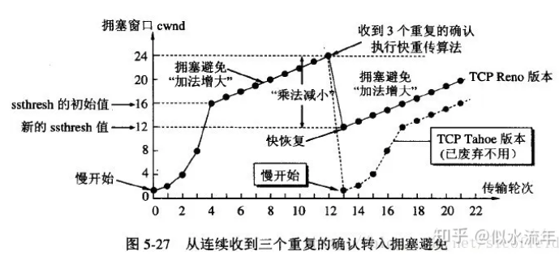

# 计算机网络

TCP UDP区别

+ TCP 是一种面向连接的协议。在数据传输前，它需要先建立连接（通过三次握手过程），之后才开始数据传输。UDP无连接
+ TCP可靠传输（顺序，重传）慢，UDP无保证，快
+ TCP拥塞控制，UDP无

### 1. 慢启动（Slow Start)

- **初始化**：TCP连接建立时，拥塞窗口（cwnd）初始化为一个较小的值（如TCP段大小的两倍）。
- **指数增长**：每当收到一个ACK，拥塞窗口cwnd增加一个段的大小。这导致窗口大小每个RTT（往返时延）指数增长。
- **阈值**：直到cwnd达到一个阈值（ssthresh），慢启动过程结束。阈值通常是网络拥塞发生前的窗口大小。

### 2. 拥塞避免（Congestion Avoidance）

- **触发：** 一旦cwnd达到ssthresh，进入拥塞避免阶段。
- **线性增长**：在这个阶段，每个RTT cwnd线性增长。
- **目的**：避免由于过度增加发送速率而导致网络拥塞。

### 3. 快速重传（Fast Retransmit）

- **触发**：如果发送方收到三个重复的ACK，意味着一个报文段可能丢失，快速重传机制被触发。
- **重传丢失的段**：而不是等待重传定时器到期。

### 4. 快速恢复（Fast Recovery）

- **触发**：当发送方连续收到三个重复确认时，就执行“乘法减小”算法
- **调整阈值**：ssthresh设置为当前cwnd的一半。
- **增加cwnd**：cwnd设置为新的ssthresh加上3倍的段大小（反映了重复ACK的数量）。
- **继续传输**：如果继续收到重复ACK，cwnd继续增加。收到新的ACK后，将cwnd设置为ssthresh（即进入拥塞避免阶段）。

### 网络拥塞的信号

TCP使用丢包作为网络拥塞的主要信号。当丢包发生时，TCP认为网络出现拥塞，并触发上述控制机制以降低发送速率。

### 五层协议

1. **物理层 (Physical Layer)**:
   - 主要任务：定义物理设备（例如，电缆、交换机、网卡等）之间如何传输原始的比特流。
   - 设备：中继器、集线器。
   - 典型技术：USB、Ethernet的物理标准、光纤、无线技术等。
2. **数据链路层 (Data Link Layer)**:
   - 主要任务：确保从一个设备到另一个设备的数据可靠地传输，通常涉及到错误检测和修复。
   - 分为两个子层：逻辑链路控制 (LLC) 和媒体访问控制 (MAC)。
   - 设备：桥接器、交换机。
   - 典型技术：Ethernet、Wi-Fi的MAC子层、PPP。
3. **网络层 (Network Layer)**:
   - 主要任务：定义如何在网络中转发数据包，通常涉及到选择最佳路径。
   - 设备：路由器。
   - 典型技术：IP (IPv4 和 IPv6)、**ICMP**、路由算法。
4. **传输层 (Transport Layer)**:
   - 主要任务：向应用程序提供通信服务，通常涉及到错误检测、流量控制和传输控制。
   - 典型技术：TCP、UDP、SCTP。
5. **应用层 (Application Layer)**:
   - 主要任务：为应用程序提供网络服务。
   - 典型技术：HTTP、FTP、SMTP、DNS、DHCP等。

#### 常用协议端口

1. **HTTP (HyperText Transfer Protocol)**:
   - 端口号: 80
2. **HTTPS (HTTP Secure or HTTP over SSL/TLS)**:
   - 端口号: 443
3. **FTP (File Transfer Protocol)**:
   - 命令: 21
   - 数据: 20
4. **SSH (Secure SHell)**:
   - 端口号: 22
5. **Telnet**:
   - 端口号: 23
6. **SMTP (Simple Mail Transfer Protocol)**:
   - 端口号: 25 (未加密)、465 (SSL/TLS)、587 (STARTTLS)
7. **DNS (Domain Name System)**:
   - 端口号: 53
8. **DHCP (Dynamic Host Configuration Protocol)**:
   - 服务器端口: 67
   - 客户端端口: 68
9. **TFTP (Trivial File Transfer Protocol)**:
   - 端口号: 69

在HTTPS通信中，TCP握手和TLS握手是两个相继发生的过程，它们并不是同时发生的。

#### TLS 握手有哪些步骤？

TLS 握手是由客户端和服务器交换的一系列数据报或消息。TLS 握手涉及多个步骤，因为客户端和服务器要交换完成握手和进行进一步对话所需的信息。

TLS 握手中的确切步骤将根据所使用的密钥交换算法的种类和双方支持的密码套件而有所不同。RSA 密钥交换算法虽然现在被认为不安全，但曾在 1.3 之前的 TLS 版本中使用。大致如下：

1. **“客户端问候（client hello）” 消息：** 客户端通过向服务器发送“问候”消息来开始握手。该消息将包含客户端支持的 TLS 版本，支持的密码套件，以及称为一串称为“客户端随机数（client random）”的随机字节。
2. **“服务器问候（server hello）”消息：** 作为对 client hello 消息的回复，服务器发送一条消息，内含服务器的 [SSL 证书](https://www.cloudflare.com/learning/ssl/what-is-an-ssl-certificate/)、服务器选择的密码套件，以及“服务器随机数（server random）”，即由服务器生成的另一串随机字节。
3. **身份验证：** 客户端使用颁发该证书的证书颁发机构验证服务器的 SSL 证书。此举确认服务器是其声称的身份，且客户端正在与该域的实际所有者进行交互。
4. **预主密钥：** 客户端再发送一串随机字节，即“预主密钥（premaster secret）”。预主密钥是使用公钥加密的，只能使用服务器的私钥解密。（客户端从服务器的 SSL 证书中获得[公钥](https://www.cloudflare.com/learning/ssl/how-does-public-key-encryption-work/)。）
5. **私钥被使用：**服务器对预主密钥进行解密。
6. **生成会话密钥：**客户端和服务器均使用客户端随机数、服务器随机数和预主密钥生成会话密钥。双方应得到相同的结果。
7. **客户端就绪：**客户端发送一条“已完成”消息，该消息用会话密钥加密。
8. **服务器就绪：**服务器发送一条“已完成”消息，该消息用会话密钥加密。
9. **实现安全对称加密：**已完成握手，并使用会话密钥继续进行通信。

#### TLS 1.3 中的握手有什么不同？

TLS 1.3 不支持 RSA，也不支持易受攻击的其他密码套件和参数。它还缩短了 TLS 握手，使 TLS 1.3 握手更快更安全。

TLS 1.3 握手的基本步骤为：

- **客户端问候：**客户端发送客户端问候消息，内含协议版本、客户端随机数和密码套件列表。由于已从 TLS 1.3 中删除了对不安全密码套件的支持，因此可能的密码套件数量大大减少。客户端问候消息还包括将用于计算预主密钥的参数。大体上来说，客户端假设它知道服务器的首选密钥交换方法（由于简化的密码套件列表，它有可能知道）。这减少了握手的总长度——这是 TLS 1.3 握手与 TLS 1.0、1.1 和 1.2 握手之间的重要区别之一。
- **服务器生成主密钥：**此时，服务器已经接收到客户端随机数以及客户端的参数和密码套件。它已经拥有服务器随机数，因为它可以自己生成。因此，服务器可以创建主密钥。
- **服务器问候和“完成”：**服务器问候包括服务器的证书、数字签名、服务器随机数和选择的密码套件。因为它已经有了主密钥，所以它也发送了一个“完成”消息。
- **最后步骤和客户端“完成”：**客户端验证签名和证书，生成主密钥，并发送“完成”消息。
- **实现安全对称加密**

https://www.cloudflare.com/zh-cn/learning/ssl/what-happens-in-a-tls-handshake/

### Web 页面请求过程

1. **DHCP 配置主机信息**
假设主机最开始没有 IP 地址以及其它信息，那么就需要先使用 DHCP 来获取。

主机生成一个 DHCP 请求报文，并将这个报文放入具有目的端口 67 和源端口 68 的 UDP 报文段中。

该报文段则被放入在一个具有广播 IP 目的地址(255.255.255.255) 和源 IP 地址（0.0.0.0）的 IP 数据报中。

该数据报则被放置在 MAC 帧中，该帧具有目的地址 FF:<zero-width space>FF:<zero-width space>FF:<zero-width space>FF:<zero-width space>FF:FF，将广播到与交换机连接的所有设备。

连接在交换机的 DHCP 服务器收到广播帧之后，不断地向上分解得到 IP 数据报、UDP 报文段、DHCP 请求报文，之后生成 DHCP ACK 报文，该报文包含以下信息：IP 地址、DNS 服务器的 IP 地址、默认网关路由器的 IP 地址和子网掩码。该报文被放入 UDP 报文段中，UDP 报文段有被放入 IP 数据报中，最后放入 MAC 帧中。

该帧的目的地址是请求主机的 MAC 地址，因为交换机具有自学习能力，之前主机发送了广播帧之后就记录了 MAC 地址到其转发接口的交换表项，因此现在交换机就可以直接知道应该向哪个接口发送该帧。

主机收到该帧后，不断分解得到 DHCP 报文。之后就配置它的 IP 地址、子网掩码和 DNS 服务器的 IP 地址，并在其 IP 转发表中安装默认网关。

2. **ARP 解析 MAC 地址**
主机通过浏览器生成一个 TCP 套接字，套接字向 HTTP 服务器发送 HTTP 请求。为了生成该套接字，主机需要知道网站的域名对应的 IP 地址。

主机生成一个 DNS 查询报文，该报文具有 53 号端口，因为 DNS 服务器的端口号是 53。

该 DNS 查询报文被放入目的地址为 DNS 服务器 IP 地址的 IP 数据报中。

该 IP 数据报被放入一个以太网帧中，该帧将发送到网关路由器。

DHCP 过程只知道网关路由器的 IP 地址，为了获取网关路由器的 MAC 地址，需要使用 ARP 协议。

主机生成一个包含目的地址为网关路由器 IP 地址的 ARP 查询报文，将该 ARP 查询报文放入一个具有广播目的地址（FF:<zero-width space>FF:<zero-width space>FF:<zero-width space>FF:<zero-width space>FF:FF）的以太网帧中，并向交换机发送该以太网帧，交换机将该帧转发给所有的连接设备，包括网关路由器。

网关路由器接收到该帧后，不断向上分解得到 ARP 报文，发现其中的 IP 地址与其接口的 IP 地址匹配，因此就发送一个 ARP 回答报文，包含了它的 MAC 地址，发回给主机。

3. **DNS 解析域名**
知道了网关路由器的 MAC 地址之后，就可以继续 DNS 的解析过程了。

网关路由器接收到包含 DNS 查询报文的以太网帧后，抽取出 IP 数据报，并根据转发表决定该 IP 数据报应该转发的路由器。

因为路由器具有内部网关协议（RIP、OSPF）和外部网关协议（BGP）这两种路由选择协议，因此路由表中已经配置了网关路由器到达 DNS 服务器的路由表项。

到达 DNS 服务器之后，DNS 服务器抽取出 DNS 查询报文，并在 DNS 数据库中查找待解析的域名。

找到 DNS 记录之后，发送 DNS 回答报文，将该回答报文放入 UDP 报文段中，然后放入 IP 数据报中，通过路由器反向转发回网关路由器，并经过以太网交换机到达主机。

4. **HTTP 请求页面**
有了 HTTP 服务器的 IP 地址之后，主机就能够生成 TCP 套接字，该套接字将用于向 Web 服务器发送 HTTP GET 报文。

在生成 TCP 套接字之前，必须先与 HTTP 服务器进行三次握手来建立连接。生成一个具有目的端口 80 的 TCP SYN 报文段，并向 HTTP 服务器发送该报文段。

HTTP 服务器收到该报文段之后，生成 TCP SYN ACK 报文段，发回给主机。

连接建立之后，浏览器生成 HTTP GET 报文，并交付给 HTTP 服务器。

HTTP 服务器从 TCP 套接字读取 HTTP GET 报文，生成一个 HTTP 响应报文，将 Web 页面内容放入报文主体中，发回给主机。

浏览器收到 HTTP 响应报文后，抽取出 Web 页面内容，之后进行渲染，显示 Web 页面。